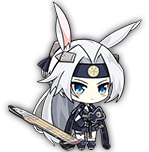

# AzureLightBot
This is a discord bot made using DSharp+ for a server about the mobile game Azur Lane.

## Commands

### !info "boatname"

Returns infomation about the ship passed - nicknames are supported. 

Infomation: Nationality, Name, Rarity, Class, How to Obtain, Voice Actress and Artist

Example: !info hiryuu

Name: IJN Hiryuu

Rarity: Elite

Class: Hiryuu-Class

Type: Aircraft Carrier

Obtainable: Explore Stage3-1

Voice Actress: Shizuka Ishigami

Artist Pixiv: https://www.pixiv.net/member.php?id=617248

### !stats "boatname"

Returns stats for the ship passed - nicknames are supported. 

Stats: Health, Firepower, Torpedo, Anti-Air, Aviation, Reload, Evasion, Speed, Luck, ASW, Oxygen, Ammo, Cost, Armor 

Example: !ship hiryuu

Health: 5468

Firepower: 0

Torpedo: 0

Anti Air: 361

Aviation: 426

Reload: 141

Evasion: 66

Speed: 34

Luck: 36

ASW: 0

Oxygen: 0

Ammo: 0

Cost: 12

Armor: Medium

### !stage "stagenumber"

Returns the enemy levels for the specified stage. SOS missions are listed under x-5, and hard mode should have the word hard after the stage number with no space

Example: !stage 3-4

3-4: Mob: L32 | Boss: L33

### !equip "equipmentType"

Returns an equipent guide image for the specified type. Accepted inputs: aa/araux/bbaux/bbgunmain/bbgunaux/cagun/clcaaux/clgun/cvaux/ddaux/ddgunmain/planes/sub/torp 

Guide credit: Nerezza
